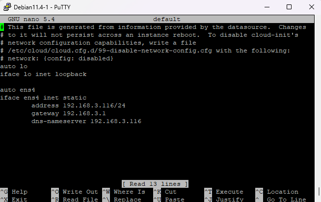
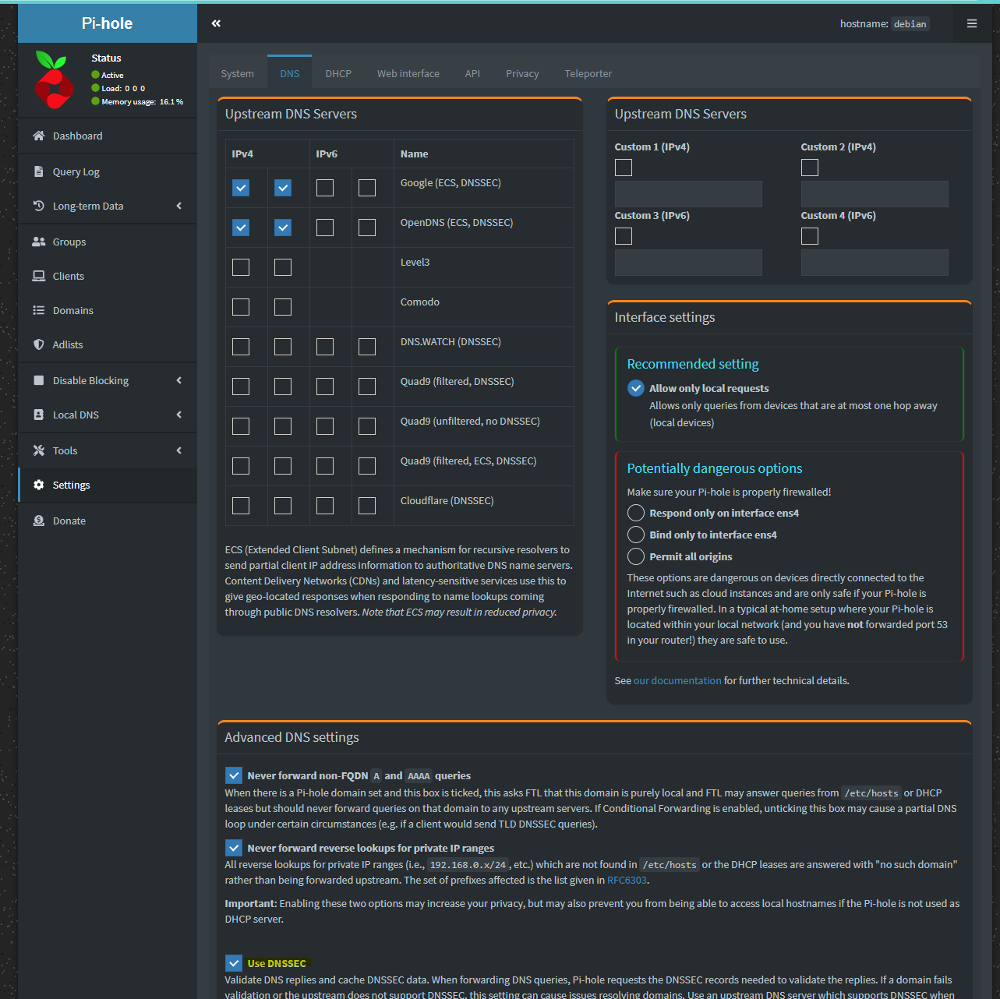
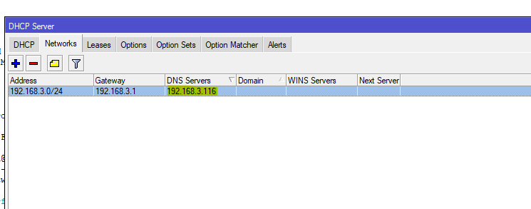
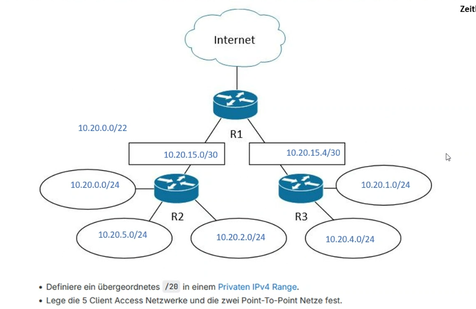

# Einführung

## GNS3 Befehle

| Befehl | Funktion |
| ---- | ---- |
| /system/identity/ set name=R1 | einen Namen setzten |
| /ping IP / Eine IP Pingen |
| /ip/address/ add address=192.168.23.16/24 interface=ether1 | Eine IP einem Ethernet zuweisen |
| /ip/address/ print | IP Adresse ansehen (wie echo) |
| /ip/dhcp-client/ print | Gibt an ob ein DHCP aktiv ist |
| vim /etc/config/network | Netzwerkkonfigurationsdatei öffnen |
| /ip service/print | Überblick über die verfügbaren Services/Konfigurationsschnittstellen |
| /export | Die gesamte Konfiguration des MikroTiks |
| /ip route print | können wir feststellen, dass eine dynamische Default-Route angelegt wurde |
| /ping cloud.tbz.ch | ob ein Uplinks ins Internet besteht |
| /export file=FILENAME | Backup machen |
| /system/package/update/install | updates machen |
| /user ssh-keys import public-key-file=id_rsa.pub user=admin | SSH key hinterlegen |
| /ip/route/add dst-address 0.0.0.0/0 gateway=192.168.96.1 | Route angeben über Terminal |

## VIM commands

| Befehl | Funktion |
| ---- | ---- |
| vim /etc/config/network | Netzwerkkonfigurationsdatei öffnen |
| i | im vim klicken um etwas anzupassen |
| esc -> : -> wq | um aus dem Vim rauszukommen |
| service network reload | reboot |
| vim /etc/config/firewall | Firewall-Konfigurationsdatei öffnen |

## DNS hinzufügen

In folgendes Verzeichnis wechseln: /ip/dhcp-client 
Danach folgenden Befehl: add interface=ether2 disable=no


## Statische IP Konfigurieren



## PI Hole installieren

Folgenden befehlt auf dem DNS ausführen:

`curl -sSL https://install.pi-hole.net | bash`

-> Login Daten merken: 
aBVoxs_i
http://192.168.3.116/admin

Um auf die Website zu kommen muss man noch eine Route öffnen (cmd mit Admin ausführen):

`route add 192.168.96.0 mask 255.255.255.0 192.168.23.135`

erste IP ist die IP des gewählten Netzwerks, die 2te die Maske davon und die 3te die IP des management netztes

Nun noch den DNSSEC aktivieren:


## DHCP Server Konfig anpassen



## Firewall Konfigurieren

1. Um zu verhinder, dass wir fehler bei der Konfig machen, werden wir als erstes eine Lockout-Regel erstellen:

`/ip firewall filter add action=accept chain=input comment=Anti-Lockout src-address=192.168.23.0/24`

Diese wird auf dem Input-Chain angelegt, das der Zugriff auf Services des Routers erlaubt werden soll.

2. Nun erstellen wir eine Interface list um ein besseren Überblick zu haben:

```bash
#Liste erstellen
/interface/list/add name=WAN
#nun listen wir unsere interfaces gleich auf
/interface/list/member/add interface=ether1 list=WAN
/interface/list/member/add interface=ether1 list=WAN
```

Dann noch das gleiche mit einer LAN liste:

```bash
#Liste erstellen
/interface/list/add name=LAN
#nun listen wir unsere interfaces gleich auf
/interface/list/member/add interface=ether4 list=LAN
```

3. Firewall Regeln erstellen

Zuerst für Input:

Damit die Firewall die Reply-Packages durchlässt, wird eine entsprechende Firewall Regel benötigt:

`/ip firewall filter add action=accept chain=input comment="input: allow established, related" connection-state=established,related`

Alle Pakete, die von Seiten WAN initiiert werden, wollen wir blockieren:

`/ip firewall filter add action=drop chain=input comment="input: default drop all from WAN" in-interface-list=WAN`

Alle Pakete, die einer Verbindung zugeordnet werden, welche sich in einem ungütligen Zustand befindet, sollen nicht zugelassen werden (Diese Regel muss vor die Regel "input: allow established, related". In Winbox und in der WebGui kann die Regel mit der Maus einfach an die entsprechende Position gezogen werden.)

`/ip firewall filter add action=drop chain=input comment="input: drop invalid" connection-state=invalid`

Nun das gleiche für Forward:

`/ip firewall filter add action=accept chain=forward comment="forward: allow established, related" connection-state=established,related`

`/ip firewall filter add action=drop chain=forward comment="forward: default drop all from WAN" in-interface-list=WAN`

`/ip firewall filter add action=drop chain=forward comment="forward: drop invalid" connection-state=invalid`

Damit unsere Konfiguration FastTrack verwenden kann muss eine weitere Regel eingefügt werden(Die forward: fasttrack established, related-Regel muss zwigend vor die forward: allowed established, related gezogen werden, sonst werden die Verbindungen nie für FastTrack markiert, weil die andere Regel zuerst greift):

`/ip firewall filter add action=fasttrack-connection chain=forward comment="forward: fasttrack established, related" connection-state=\established,related hw-offload=yes`


R2 und R3 wieder erlauben:

Vorher die Adressen der Router in der Adress List hinterlegen.

`/ip firewall filter add action=accept chain=forward protocol=tcp dst-port=22,8291 comment="Connect WINBOX to Routers" src-address=192.168.23.0/24 dst-address-list=routers`


4. Port Forwarding

Konfiguriere Port-Forwarding, sodass der Port 2222 auf R1 den Port 22 von R3 weitergeleitet wird.
`/ip firewall nat add chain=dstnat protocol=tcp dst-port=2222 action=dst-nat to-addresses=192.168.96.1 to-ports=22`

5. Port Trigger Regel

`/ip firewall mangle add action=add-src-to-address-list address-list=portscanblock address-list-timeout=1d chain=prerouting comment="port scan detection rule" dst-port=21,1723,110 in-interface-list=WAN protocol=tcp`

Lege auf der Input- und Forward-Chain eine Firewall-Regel an, die alle Pakete blockiert, dessen Source-IP sich in der Address-list portscanblock befindet
`/ip firewall filter add action=drop chain=forward comment="forward: default drop portscanblock from WAN" in-interface-list=WAN src-address-list=portscanblock`
`/ip firewall filter add action=drop chain=input comment="input: default drop portscanblock from WAN" in-interface-list=WAN src-address-list=portscanblock`

Kurze Übung im Unterricht:

